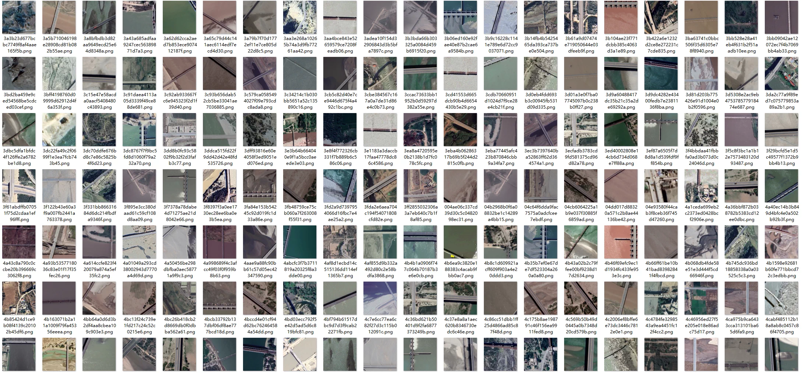
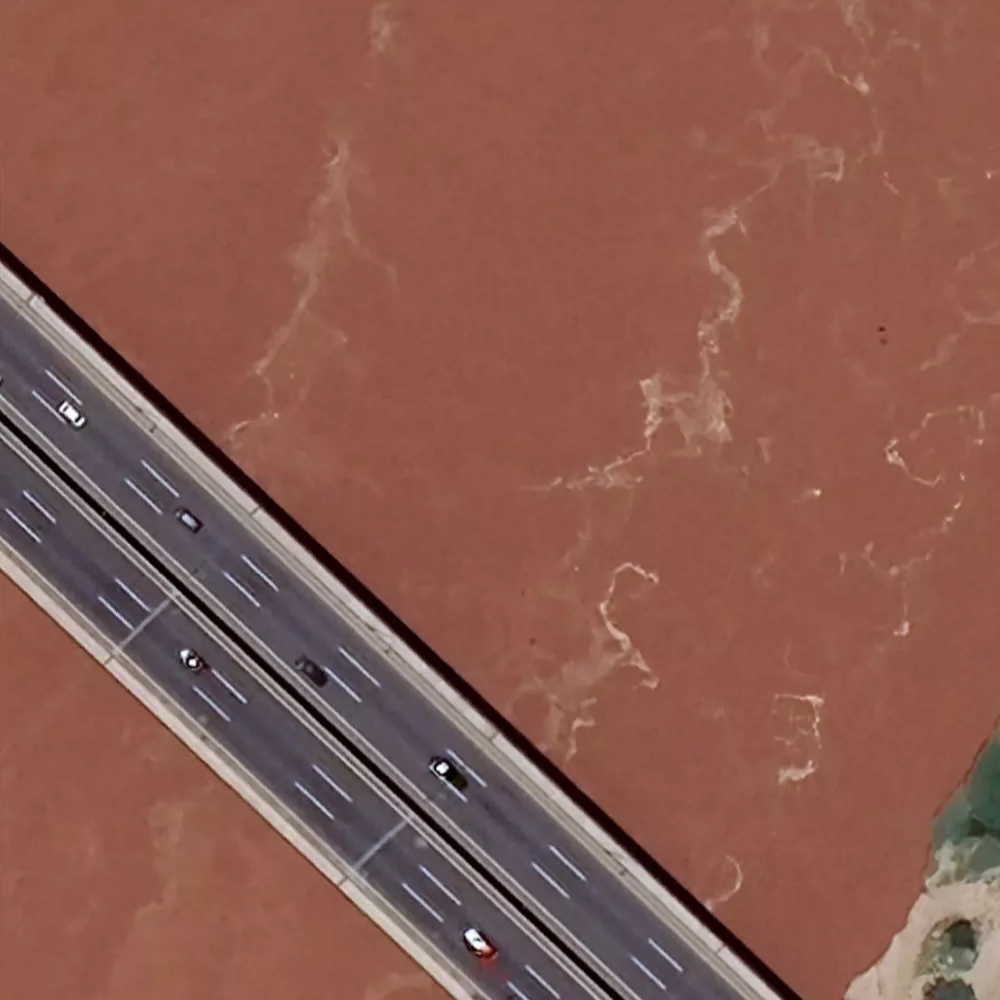
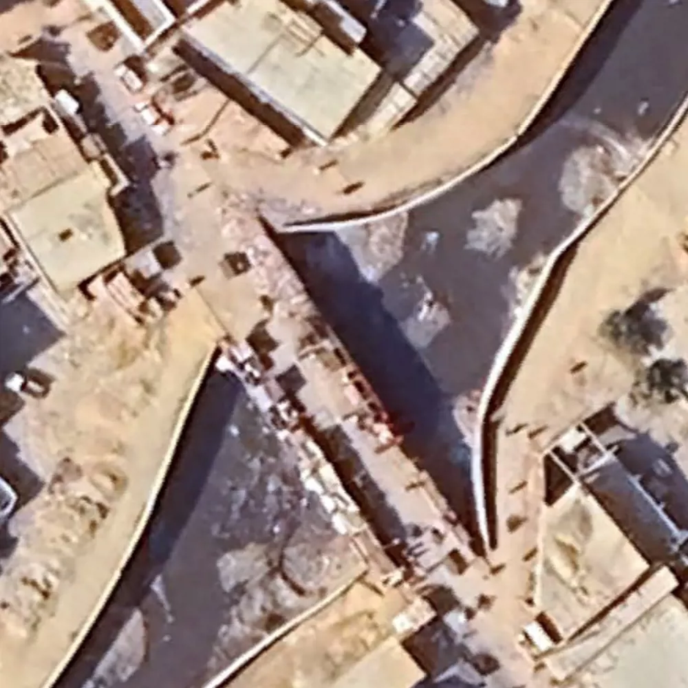
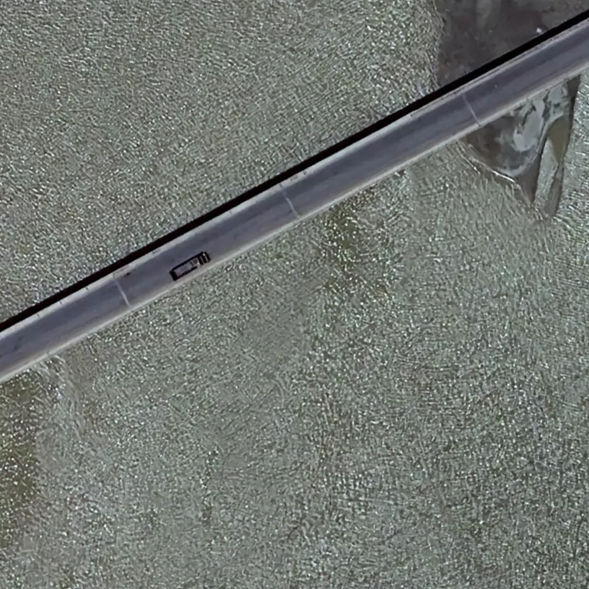
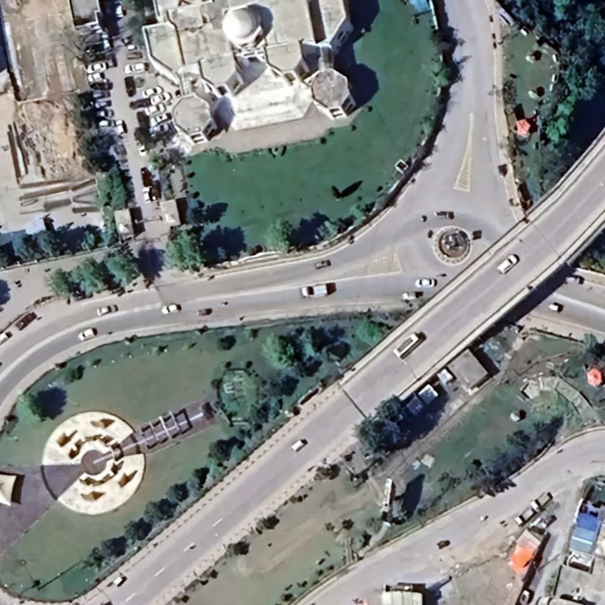
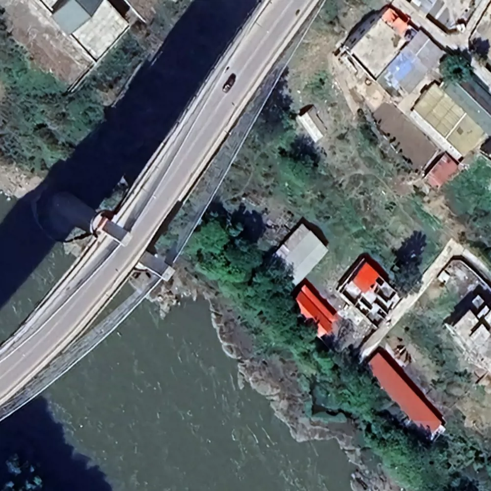
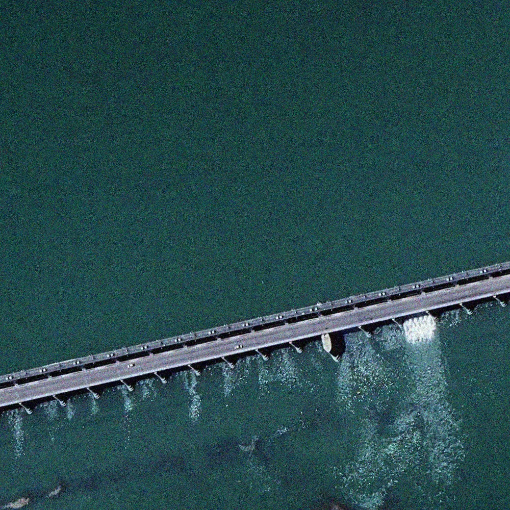
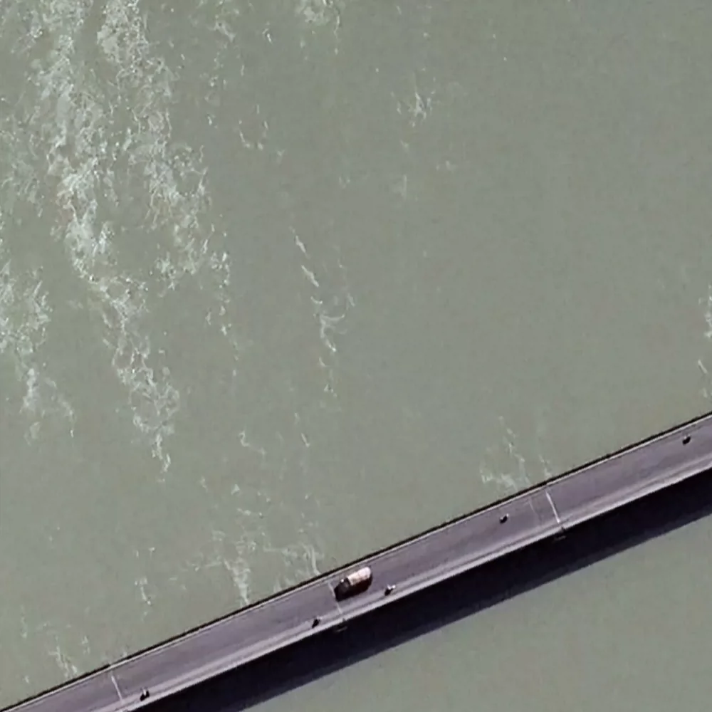

## Body

High-Resolution Satellite Imagery Dataset for Bridge Object Detection in Pakistan

This dataset consists of 5181 images, each labeled with a specific category. It has been divided into three parts: train (3627), validation (1036), and test (518).

The images are 1000 × 1000 pixels in size, and the file size is 6.9GB. The dataset covers various bridge structures within Pakistan, including highway bridges, railway bridges, pedestrian bridges, etc., and is suitable for computer vision tasks such as bridge inspection and infrastructure monitoring. The data has been preprocessed and annotated in the YOLO format.

There is only one category: Bridge.

Electronic virtual products sold are non-refundable.

## Images

item_1070313601603

Here is a pay link on Stripe ( https://buy.stripe.com/3cs8yP7sY87d0vu9AB ). Please contact me lonlonago@foxmail.com after funding $89, and I will send you a complete data files , thank you!

